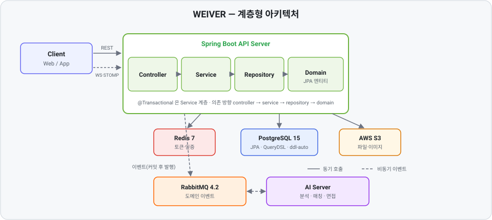

<div align="center">

# 🧩 WEIVER

### 검증된 인재를 엮다, 위버

**AI 면접·채용 매칭 플랫폼**의 백엔드 서버
구직자 프로필·자기소개서·포트폴리오를 AI로 분석하고, 채용 공고(JD)를 분석해
기업과 구직자를 매칭하며, AI 면접(WebSocket)을 진행합니다.

<br/>


</div>

---

## 📖 소개

WEIVER는 **"검증된 인재와 기업을 연결하는"** 서비스입니다. AI 처리는 별도의 AI 서버가 담당하며,
Spring 서버와는 **RabbitMQ 이벤트**로만 연동합니다.

- 🧑‍💻 **구직자** — 프로필/이력서/자기소개서/포트폴리오를 등록하면 AI가 역량을 분석합니다.
- 🏢 **기업** — 채용 공고(JD)를 등록하면 분석 결과를 바탕으로 적합한 지원자를 매칭받습니다.
- 🎙️ **AI 면접** — STOMP WebSocket 기반으로 실시간 AI 면접을 진행하고 리포트를 생성합니다.

---

## ✨ 주요 기능

| 영역 | 설명 |
| --- | --- |
| 🔐 인증 | JWT(Access/Refresh) 기반 인증, 리프레시 토큰 회전·재사용 감지, 이메일 인증 |
| 📄 프로필 분석 | 이력서·자기소개서·포트폴리오 등록 및 AI 분석(비동기 이벤트) |
| 🧾 공고 분석 | 채용 공고(JD) 등록 및 AI 분석 |
| 🤝 매칭 | 스킬핏·컬처핏 기반 기업↔구직자 매칭 및 결과 리포트 |
| 🎤 AI 면접 | STOMP WebSocket 실시간 면접 플로우 및 리포트 생성 |
| 🔔 알림·대시보드 | 기업 대시보드, 신규 지원자 알림 |

---

## 🛠️ 기술 스택

| 구분 | 기술 |
| --- | --- |
| **Language / Framework** | Java 21, Spring Boot 3.5.13, Gradle(Wrapper) |
| **Persistence** | PostgreSQL 15 (단일 DataSource, Hibernate `ddl-auto`), Spring Data JPA, QueryDSL 5.1.0 |
| **Cache / Store** | Redis 7 (JWT 토큰·이메일 인증 등 임시 키-값 저장) |
| **Messaging** | RabbitMQ 4.2 (도메인 이벤트, AI 서버 연동) |
| **Security** | Spring Security, JWT (JJWT 0.12.6) |
| **Realtime** | WebSocket (STOMP) |
| **Cloud / Infra** | AWS S3 · SQS (Spring Cloud AWS) |
| **Docs / Monitoring** | springdoc-openapi(Swagger) 2.8.13, Sentry |
| **Test** | JUnit 5, Mockito, AssertJ, Testcontainers 1.20.4 (PostgreSQL) |

---

## 🏛️ 아키텍처

전통적 **계층형(layered) 아키텍처**입니다. DDD 헥사고날이 아니며, `domain` 패키지가 곧 JPA 엔티티입니다.

<div align="center">
  
</div>

### 패키지 구조

```
com.weiver.<context>.<layer>          업무 컨텍스트(모듈)
  <layer> = controller / service / domain(JPA 엔티티) / dto(request,response)
            / repository / event(dto,handler) / type(enum)

com.weiver.global.<area>              공통 기반
  <area> = common / exception / event(RabbitMQ 인프라) / security(JWT,WebSocket)
           / auth / s3 / email / logging / config
```

- **의존 방향:** `controller → service → repository → domain`
- **트랜잭션:** `@Transactional`은 **서비스 계층에만** 부여
- **컨텍스트 간 통신:**
  - 동기 — 다른 컨텍스트의 service/repository 직접 주입 (느슨한 격리)
  - 비동기 — AI·장기 파이프라인은 **RabbitMQ 도메인 이벤트** (커밋 후 발행)

### 컨텍스트(모듈)

| 컨텍스트 | 역할 |
| --- | --- |
| `auth` | 인증·토큰·이메일 인증 |
| `applicant` | 구직자 프로필·이력(학력/경력/수상/자격증) |
| `company` | 기업 정보 |
| `jobposting` | 채용 공고(JD) |
| `essay` | 자기소개서 |
| `portfolio` | 포트폴리오 |
| `interview` | AI 면접(WebSocket) |
| `analysis` | AI 분석 리포트 |
| `matching` | 기업↔구직자 매칭 |
| `notification` | 알림 |
| `dashboard` | 기업 대시보드 |

---

## 🚀 시작하기

### 1. 로컬 인프라 실행

PostgreSQL · Redis · RabbitMQ를 Docker로 띄웁니다.

```bash
docker compose up -d
```

| 서비스 | 이미지 | 비고 |
| --- | --- | --- |
| PostgreSQL | `postgres:15-alpine` | 메인 데이터베이스 |
| Redis | `redis:7-alpine` | 토큰·인증 임시 저장 |
| RabbitMQ | `rabbitmq:4.2.6-management` | 이벤트 브로커 (management UI 포함) |

> 환경 변수는 `env_file`을 참고하세요. 민감 설정(`application-local.yml`, `application-prod.yml`, `.env`)은 커밋되지 않습니다.

### 2. 애플리케이션 실행

```bash
# Windows
.\gradlew.bat bootRun

# macOS / Linux
./gradlew bootRun
```

### 3. API 문서 (Swagger)

애플리케이션 실행 후 아래에서 API 명세를 확인할 수 있습니다.

```
http://localhost:8080/swagger-ui/index.html
```

---

## ✅ 테스트

```bash
# Windows
.\gradlew.bat test

# macOS / Linux
./gradlew test
```

- **대부분의 테스트는 DB 없이** 동작합니다 — 서비스는 Mockito 단위 테스트, 컨트롤러는 `@WebMvcTest`,
  이벤트 핸들러·WebSocket 컨트롤러는 순수 단위 테스트입니다.
- **리포지토리 테스트만** Testcontainers로 실제 PostgreSQL(`postgres:15-alpine`)을 띄웁니다
  (`@DataJpaTest` + `@ServiceConnection`). 이때 **Docker 데몬이 실행 중**이어야 합니다.

---

## 📐 컨벤션

프로젝트 규약은 `.claude/skills/` 아래에 정리되어 있습니다. 작업 범위에 맞는 규약을 먼저 확인하세요.

| 범위 | 규약 |
| --- | --- |
| 계층 구조·컨텍스트 통신·RabbitMQ 이벤트·WebSocket | `architecture-conventions` |
| 컨트롤러·서비스·도메인·DTO·테스트 | `backend-conventions` |
| 명명·예외·응답 봉투·보안·로깅·S3·이메일 | `global-conventions` |
| JPA 엔티티·리포지토리·QueryDSL·트랜잭션 | `persistence-conventions` |
| Redis 키-값 저장소(토큰·인증) | `redis-conventions` |

### 브랜치 · 커밋

```
브랜치   <type>/#<이슈번호>-<간단설명>     예) feat/#115-profile-submission-status
커밋     <type>(scope): 설명 (#이슈)       예) fix(security): 사용자 열거 차단 (#117)
```

`type` — `feat` · `fix` · `refactor` · `chore` · `test` · `docs` · `style`

---

<div align="center">

**TEAM WEIVER**

</div>
